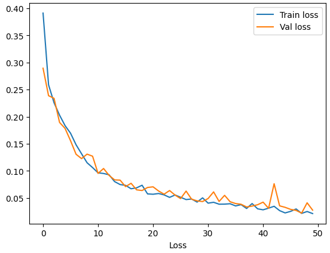

# Multi-Label Sequence Classifier

A Deep Learning project that utilizes Long Short-Term Memory (LSTM) networks to perform multi-label classification on dynamic, multi-dimensional time series data. 

## Project Structure
- `config.py`: Centralized hyperparameters and directory paths.
- `data.py`: Handles loading `.npz` dataset splits and generating batched, padded `tf.data.Dataset` pipelines.
- `model.py`: Defines the Keras LSTM architecture with sequence masking.
- `train.py`: Contains the model training loop, early stopping logic, and history serialization.
- `eval.py`: Calculates classification metrics, generates Precision-Recall curves, and tunes F1-score decision thresholds.
- `visualize.py`: Generates matplotlib plots comparing ground truth sequences against model predictions.
- `main.py`: The central execution script that ties all modules together.

## training/validation process

## Requirements
Ensure you have the following installed:
- TensorFlow
- NumPy
- Scikit-Learn
- Matplotlib
